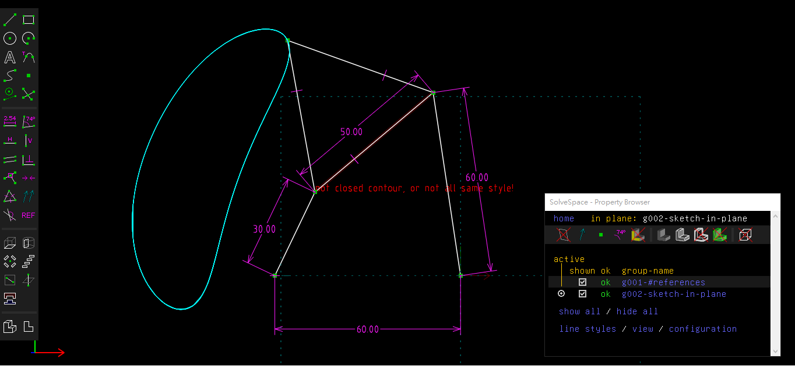

Title: 20170420 第九週
Date: 2017-04-20
Category: Course
Tags: syllabus, w9
Slug: 2017spring-cd-W9
Author:40423146

期中作業

分析四連桿軌跡圖

使用 OnShape 完成四連桿行走機構

<!-- PELICAN_END_SUMMARY -->

##協同產品設計實習課程 第九週

分析四連桿軌跡圖

使用 OnShape 完成四連桿行走機構

<iframe width="560" height="315" src="https://www.youtube.com/embed/EORo8OShl58" frameborder="0" allowfullscreen></iframe>

分組協同零件展示

<link href="./../data/madeleine/src/css/Madeleine.css" rel="stylesheet">

select stl file: <input type="file" id="file" /> or drop stl file

